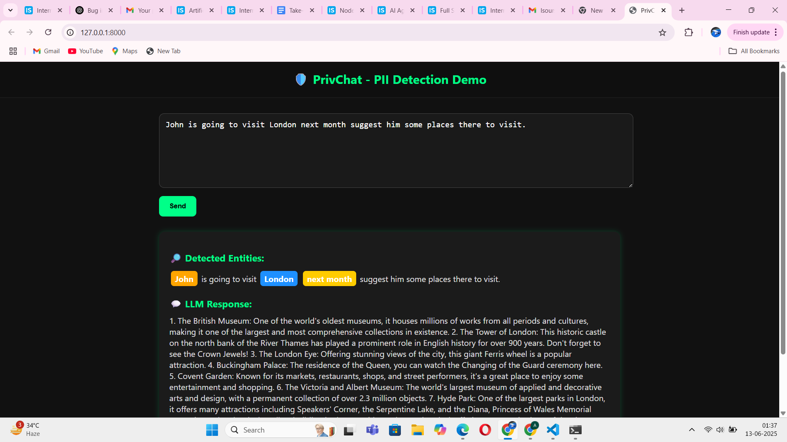

# LLM + Named Entity Recognition App

A lightweight web application that combines **Named Entity Recognition (NER)** using spaCy with a locally running **Large Language Model (LLM)** (via Ollama) to analyze user prompts and provide contextual responses.

---

## Overview

This application allows users to type natural language prompts in a web interface. It performs the following:

- Extracts named entities using `spaCy`.
- Sends the input to a local LLM (e.g., Mistral) via the Ollama API.
- Highlights detected entities in the original prompt.
- Displays the LLM-generated response below the input.

---

## Features

- Interactive and responsive UI for typing prompts and viewing results.
- Highlights entities such as PERSON, LOCATION, ORGANIZATION, DATE, etc.
- Seamless integration with Ollama for local LLM response generation.
- Modern dark-themed interface for readability and improved user experience.

---

## Screenshot

Here’s how the UI looks:

> You can take a screenshot of your running app and save it as `Screenshot.png` in the root of your project directory before pushing to GitHub.

---

## Tech Stack

**Backend**: FastAPI  
**NER Engine**: spaCy (`en_core_web_sm`)  
**LLM**: Mistral or any other Ollama-supported local model  
**Frontend**: HTML, CSS, JavaScript (Vanilla)

---

## Project Structure
├── index.html # Frontend UI
├── main.py # FastAPI backend with spaCy & Ollama integration
├── requirements.txt # Python dependencies
├── screenshot.png # (Optional) UI screenshot

---

## Getting Started

### 1. Clone the Repository

git clone https://github.com/aditya22034/chatbot.git
cd chatbot

2. Set Up the Python Environment
Make sure you have Python 3.8+ and pip installed.

pip install -r requirements.txt
python -m spacy download en_core_web_sm

3. Start Ollama and Load Your Model
Make sure Ollama is installed and the model is available:

ollama run mistral

4. Run the FastAPI Server
uvicorn main:app --reload

5. Open the App
Visit http://localhost:8000 in your browser to use the app.
